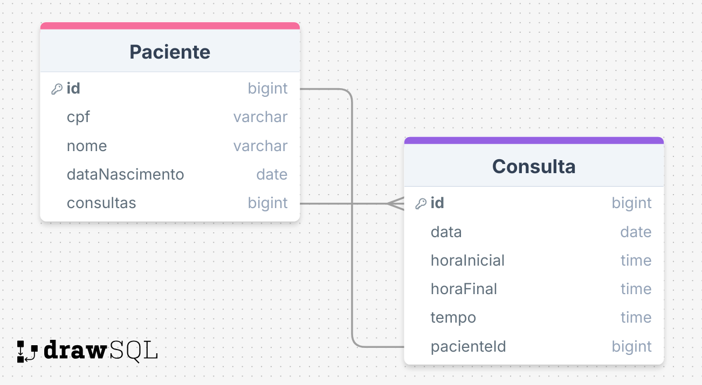

# Especificação - Sistema de Agenda para Consultório Odontológico

## Minimundo
O sistema será uma API Rest desenvolvida para gerenciar a agenda de um consultório odontológico. 
A aplicação permitirá o cadastro de pacientes, o agendamento e cancelamento de consultas, e a listagem de pacientes e da agenda. 
As funcionalidades e regras de negócio estão detalhadas abaixo.

## Funcionalidades
### 1. Inclusão de Pacientes no Cadastro
- **Descrição:** Permite o cadastro de novos pacientes na base de dados do consultório.
- **Requisitos:**
  - CPF, nome e data de nascimento do paciente são obrigatórios.
  - **Regras:**
    - CPF deve ser válido (RN0).
    - O nome do paciente deve ter no mínimo 5 caracteres.
    - A data de nascimento deve estar no formato `DD/MM/AAAA`.
    - Dados inválidos exibem uma mensagem de erro.
    - Não é permitido o cadastro de dois pacientes com o mesmo CPF.
    - O paciente deve ter 13 anos ou mais no momento do cadastro (data atual).
  - **Endpoint:**
    - POST /paciente
  - **Corpo da Requisição:**
```
{
  "cpf": "string",
  "nome": "string",
  "dataNascimento": "string: 'DD/MM/AAAA"
}
```

### 2. Exclusão de Pacientes do Cadastro
- **Descrição:** Remove um paciente do cadastro.
- **Requisitos:**
  - CPF do paciente é necessário.
  - **Regras:**
    - Pacientes com consultas futuras não podem ser excluídos.
    - Pacientes com consultas passadas podem ser excluídos, e os respectivos agendamentos são também excluídos.
  - **Endpoint:**
    - DELETE /paciente
  - **Corpo da Requisição:**
```
{
  "cpf": "string",
}
```

### 3. Agendamento de Consulta
- **Descrição:** Agenda uma consulta para um paciente cadastrado.
- **Requisitos:**
  - CPF do paciente, data da consulta, hora inicial e hora final.
  - **Regras:**
    - CPF deve existir no cadastro.
    - Data deve estar no formato `DD/MM/AAAA`.
    - Horas inicial e final devem estar no formato `HHMM` (padrão brasileiro).
    - A consulta deve ser agendada para uma data futura: `data da consulta > data atual` ou `data da consulta = data atual` e `hora inicial > hora atual`.
    - Hora final deve ser maior que a hora inicial.
    - Apenas um agendamento futuro por paciente.
    - Não são permitidos agendamentos sobrepostos.
    - As horas devem ser múltiplas de 15 minutos (e.g., 1400, 1730).
    - As consultas devem ocorrer entre 8:00h e 19:00h.
  - **Endpoint:**
    - POST /consulta
  - **Corpo da Requisição:**
```
{
  "cpf": "string",
  "data": "string",
  "horaInicial": "string",
  "horaFinal": "string"
}
```

### 4. Cancelamento de um Agendamento
- **Descrição:** Cancela uma consulta previamente agendada.
- **Requisitos:**
  - CPF do paciente, data da consulta, e hora inicial.
  - **Regras:**
    - Cancelamentos podem ser realizados apenas para agendamentos futuros (data e hora maior que a atual).
  - **Endpoint:**
    - DELETE /consulta/cancelar
  - **Corpo da Requisição:**
```
{
  "cpf": "string",
  "data": "string",
  "horaInicial": "string"
}
```


### 5. Listagem de Pacientes
- **Descrição:** Exibe uma lista dos pacientes cadastrados
- **Requisitos:**
  - A lista pode ser ordenada por CPF ou nome.
  - **Regras:**
    - Exibir dados de agendamento futuros do paciente, caso existam.
    - Dados devem estar formatados conforme definido abaixo.
  - **Endpoint:**
    - GET /pacientes
  - **Parametros de consulta da Requisição:**
    - sort={nome,ASC, ou nome,DESC, ou cpf,ASC, ou cpf,DESC}
  - **Resposta da requisição:**
```
[
  {
    "cpf": "string",
    "nome": "string",
    "dataNascimento": "string",
    "idade": "integer"
    "consulta": {
      "data": "string",
      "horaInicial": "string",
      "horaFinal": "string"
    }
  },
  ...
]
```

### 6. Listagem da Agenda
- **Descrição:** Exibe uma lista da agenda de consultas
- **Requisitos:**
  - A lista pode mostrar toda a agenda ou uma agenda de um período específico.
  - **Regras:**
    - Dados devem estar ordenados por data e hora inicial.
    - Exibir apenas o intervalo especificado pelo usuário, se solicitado
    - Dados devem estar formatados conforme layout.
  - **Endpoint:**
    - GET /consultas
  - **Parametros de consulta da Requisição:**
    - dataInicial="string => 01/01/2024", Não obrigatório
    - dataFinal="string => 31/12/2024", Não obrigatório
  - **Resposta da requisição:**
```
[
  {
    "data": "string",
    "horaInicial": "string",
    "horaFinal": "string",
    "tempo": "string",
    paciente: {
      "nome": "string",
      "dataNascimento": "string => DD/MM/YYYY"
    }
  },
  ...
]
```

## Modelagem de Entidade-Relacionamento:


